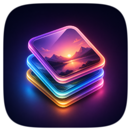
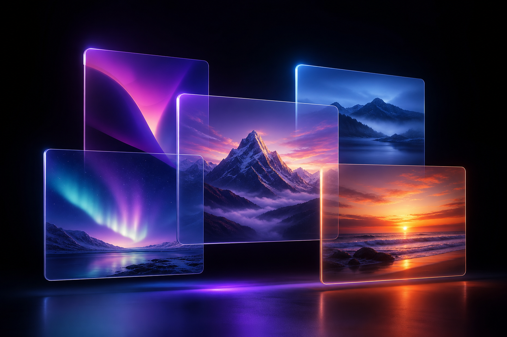

<div align="center">



# Omnigen Vault

**無限の、テキストなし画像エンジン + 自動キュレーション多言語ギャラリー — と、AIが操作するMCP。**

あらゆる種類の画像をあらゆるアート スタイルで生成でき、
**フレーム内にテキストがゼロ** — カテゴリと解像度で整理、サムネイル化、
**多言語フルテキスト インデックス** (EN · KO · JA · ZH · ES) を備えた、閲覧可能なスリックな
ウェブギャラリーで、任意のAIが **MCP** を通じてすぐに再利用できます。

[**🔍 ライブギャラリー →**](https://gallery.ezbuilder.app) · [**AI向けMCP**](#-任意のaiアプリから使用mcp) · [English](../README.md) · [한국어](README.ko.md) · **日本語** · [中文](README.zh.md) · [Español](README.es.md)

`Node ≥22` · **npmの依存なし** · macOS メニューバー アプリ · MIT



</div>

> ### ⚠️ サポートされていないバックエンド — 自己責任で使用してください
> Omnigen は、**ドキュメント化されていない非公開の ChatGPT/Codex バックエンド** を呼び出すことで画像を生成します。あなたの**ローカル ChatGPT 認証トークン** を使用します — これは **公式の OpenAI API ではありません**。契約は予告なく変更または破損する可能性があり、**大量使用は ChatGPT アカウントにリスク** をもたらす可能性があります (レート制限または制限)。あなたのトークンはランタイムで読み込まれ、**Omnigen によって保存されることはありません**。ただし、**自己責任で使用** してください。本番ワークロードには公式の [OpenAI API](https://platform.openai.com/) を使用してください。個人使用に推奨されます。

---

## ✨ 特別な理由

- **設計による無限。** 決定論的で再開可能なプロンプト エンジンが **67
  つの実世界カテゴリ** × **270+ 研究されたアート スタイル** × ライティング × パレット ×
  構成 × ムード — リサイクルを開始する前に **16 億以上の** 基本組み合わせ。いつでも停止して再開できます。繰り返されません。
- **地球上のあらゆるスタイル。** 写真撮影
  (アナログとデジタル)、古典 → 現代絵画、世界/フォーク/先住民の
  伝統、イラスト/3D/CGI、版画と工芸、現代美学にわたる 270 以上のテキストなし視覚スタイル —
  分散されているため、*すべての* バッチは視覚的に多様で、単調な実行ではありません。
- **真のテキストなし。** すべてのプロンプトはテキストを禁止しており、各画像は **OCR で検証** されます
  (信頼度フィルタリングテクスチャ ノイズを無視する);実際の文字を含むものはすべて
  自動再生成または隔離されます。
- **自己整理ボールト。** `images/<category>/<resolution>/` に保存し、
  **サムネイル** を生成、**FTS5** フルテキスト検索 + 評価 + 知覚的ハッシュ除外の **SQLite** にすべてをインデックスします。
- **2 つのギャラリー。** 自己完結したスタティック `gallery.html` と、**ライブ
  多言語ウェブ サーバー** (検索、フィルター、無限スクロール、ライトボックス、ブラウザ内
  評価) を Cloudflare Tunnel を通じて世界に公開できます。
- **Mac をクラッシュさせません。** ハード ディスク使用量の上限 + OS ボリューム ガード + 空き容量の
  フロア。並行、低メモリ、即座キャンセル。
- **ネイティブ メニューバー アプリ。** 開始/停止、オプション選択、保存フォルダ変更、ログイン時の起動、ギャラリー構築 —
  クリーンなアイコン駆動メニューからすべて。コード署名済み。
- **AI ネイティブ。** エージェントが完璧な画像をすぐに見つけて使用できるように、マシン可読クエリ API (下記参照)。

<div align="center">
&nbsp;
<br><sub>すべての画像は 100% テキストなしで OCR 検証済み。</sub>
</div>

## 🚀 クイック スタート

```bash
git clone <your-repo-url> omnigen-vault && cd omnigen-vault
node bin/omnigen doctor          # checks auth, disk, OCR, thumbnails, sqlite
node bin/omnigen generate        # infinite, resumable generation (Ctrl-C to stop)
node bin/omnigen gallery && open "$(node bin/omnigen stats >/dev/null; echo)"  # build a gallery
```

要件: **Node 22+** (組み込み `node:sqlite` + `fetch` を使用 — `npm install` なし)、
ログイン済み Codex/ChatGPT セッション、OCR 用 `tesseract` (`brew install tesseract`)、
ボールト用にマウントされた外部/データ ディスク。

## 🤖 AI エージェント向け — 読み込み、インストール、および使用

ゼロから結果まで、順序通りにすべてを実行します。**npm install なし** — CLI、MCP サーバー、およびウェブ サーバーはピュア Node です。生成は**ローカル ChatGPT/Codex 認証** (`~/.codex/auth.json`) を再利用します。一度ログイン (Codex CLI / ChatGPT アプリ) して `doctor` で検証します。

**1. 前提条件** — 不足しているものだけをインストール:

```bash
node --version             # need ≥ 22   → else: brew install node   (or https://nodejs.org)
brew install tesseract     # OCR text-check (optional — or run generate with --no-ocr)
brew install cloudflared   # only if you'll expose a public URL (optional)
```

**2. インストール & 生成:**

```bash
git clone https://github.com/ezBuilder/omnigen-vault.git && cd omnigen-vault
node bin/omnigen doctor                 # checks auth, disk, OCR, sqlite — fix what it flags
node bin/omnigen generate               # infinite, resumable, text-free (Ctrl-C to stop)
```

**3. 画像を検索して再利用する — 1 つのマシン可読コマンド:**

```bash
node bin/omnigen query "misty mountain at golden hour" --json --limit 5
```

```json
[{ "path": "~/.omnigen-vault/images/mountains-peaks/landscape/...png",
   "category": "mountains-peaks", "style": "impressionist painting, broken color",
   "size": "1536x1024", "prompt": "…", "tags": ["…"] }]
```

…またはライブ サーバーの JSON API をクエリするか、Node から呼び出します:

```bash
node bin/omnigen serve --port 8787
curl 'localhost:8787/api/search?q=neon%20city&minRating=4&limit=10'
```

```js
import { resolveConfig, queryVault } from './src/index.js';
const hits = queryVault(resolveConfig(), { query: 'a red fox in snow', limit: 3 });
```

**4. または、MCP を経由してエージェントに直接接続** — 1 つのコマンドで、AI がボールトを検索し、画像をインラインで取得できます (詳細は以下):

```bash
claude mcp add omnigen --env OMNIGEN_VAULT_ROOT=~/.omnigen-vault -- npx -y -p github:ezBuilder/omnigen-vault omnigen-mcp
```

## 🔌 任意の AI アプリから使用 (MCP)

Omnigen は **MCP サーバー** を搭載しているため、AI はボールトを検索し、**画像をインラインで表示** でき、カテゴリを参照し、新しい画像を生成できます — すべて **ローカル、自分のマシンと自分のクォータで** 。検索は **韓国語 / 日本語 / 中国語 / スペイン語** でも機能し、結果は **ローカライズされた** サブジェクト + プロンプトで返されます。

**ツール:** `search_images` (ローカライズ; カテゴリ / 向き / 評価でフィルター) · `get_image` (ID またはパスで) · `list_categories` (ローカライズされたラベル + カウント) · `generate_image`。

Claude Code / Codex / Cursor / Claude Desktop に追加:

```bash
# straight from GitHub — no npm publish needed; works as soon as the repo is public:
claude mcp add omnigen --env OMNIGEN_VAULT_ROOT=~/.omnigen-vault -- npx -y -p github:ezBuilder/omnigen-vault omnigen-mcp

# or from a local clone (most reliable, fully offline):
claude mcp add omnigen --env OMNIGEN_VAULT_ROOT=~/.omnigen-vault -- node /ABSOLUTE/PATH/omnigen-vault/bin/omnigen-mcp
```

…または任意の MCP クライアント (Cursor、Claude Desktop、Antigravity) 用の JSON 構成ブロック:

```json
{
  "mcpServers": {
    "omnigen": {
      "command": "npx",
      "args": ["-y", "-p", "github:ezBuilder/omnigen-vault", "omnigen-mcp"],
      "env": { "OMNIGEN_VAULT_ROOT": "~/.omnigen-vault" }
    }
  }
}
```

npm に公開されると、より短い `npx -y -p omnigen-vault omnigen-mcp` も機能します。

その後、エージェントに*「霧のかかった山を朝焼けで見つけて」*または*「水彩画のキツネを生成して」*と聞いてください — ツールを呼び出し、画像を **インラインで** 取得します。

**エージェント スキル** — スキル対応エージェントの場合、`skills/omnigen/` をスキル ディレクトリ (`~/.claude/skills/`、`~/.codex/skills/`、またはプロジェクト `.agents/skills/`) にコピーします。

**最新の状態に保つ:** `omnigen upgrade` (git pull / npx) は最新バージョンに更新します。

## 🪟 クロス プラットフォーム & Windows

**CLI、MCP サーバー、ウェブ サーバーはピュア Node** → macOS、Linux、
Windows で実行されます。macOS メニューバー アプリの代わりに、CLI からすべてを構成します:

```bash
omnigen config setup          # guided settings (save folder, size, concurrency, OCR, disk limit)
omnigen config set size fhd   # or set individual keys
omnigen config show           # view saved + effective settings
```

設定は `~/.omnigen-vault.json` に保持されます (`$OMNIGEN_CONFIG` でパスをオーバーライド)
すべてのコマンドに適用されます。Windows では、Node ≥22 をインストールします。サムネイル (macOS `sips`)
はグレースフルにスキップされます (ギャラリーはフル画像にフォールバック)。OCR の場合は
Tesseract をインストールし、`OMNIGEN_TESSERACT` を `tesseract.exe` に指し、`--no-ocr` を実行します。
ネイティブ メニューバー **アプリ** は macOS のみです。

## 🖥️ メニューバー アプリ (macOS)

```bash
bash app/build.sh                       # compiles, embeds icon, code-signs
ditto app/OmnigenVault.app /Applications/OmnigenVault.app
open /Applications/OmnigenVault.app
```

クリーンなメニューバー メニュー (SF シンボル アイコン、クラッタなし): 開始/停止トグル、単語で生成、
ギャラリー構築、フォルダを開く、**設定** ウィンドウ
(保存位置 · 同時実行性 · 解像度 · OCR · ディスク天井 · ログイン時の起動 ·
自動開始)。メニューのライブ カウント + ディスク %。終了時は常にワーカーを停止します。

## 🌐 公開にする — あなた独自の URL（オプション）

ギャラリーは通常のローカル HTTP サーバーなので、**任意の** トンネルでそれを公開 HTTPS URL に変えられます — **独自のドメインやアカウントは必要ありません**。サーバーを起動し、いずれかのトンネルを選択してください:

```bash
node bin/omnigen serve --public --port 8787        # read-only, hardened

# expose it with ONE of these (each prints a public URL):
cloudflared tunnel --url http://localhost:8787     # Cloudflare — free, no account (*.trycloudflare.com)
npx localtunnel --port 8787                         # localtunnel — free, no account
ngrok http 8787                                     # ngrok — free tier (sign-up)
tailscale funnel 8787                               # Tailscale — if you already use it
```

公開 URL が **不要** ですか？トンネルをスキップして、単に `http://localhost:8787` で提供してください（プラス LAN）。

### Cloudflare トンネル、詳細

一度インストール — `brew install cloudflared` (macOS) · `winget install Cloudflare.cloudflared` (Windows) · または [Cloudflare のダウンロード](https://developers.cloudflare.com/cloudflare-one/connections/connect-networks/downloads/) からバイナリ。その後、**A**（インスタント、匿名）または **B**（独自ドメイン）を選択:

```bash
# A) Quick & anonymous — a throwaway public URL, no login, no domain:
cloudflared tunnel --url http://localhost:8787      # → https://<random>.trycloudflare.com

# B) Your own domain — a stable URL via a NAMED tunnel (one-time interactive login):
cloudflared tunnel login                            # opens a browser; authorize your domain
cloudflared tunnel create omnigen                   # creates the tunnel + credentials
cloudflared tunnel route dns omnigen gallery.example.com
cloudflared tunnel run --url http://localhost:8787 omnigen
```

**B** では、`https://gallery.example.com` がマシンの IP が変わっても指し続けます — 著者のライブ デモ `gallery.ezbuilder.app` がどのように実行されているかと同じです。あなたは自分のものを実行します；リポジトリ内に著者の URL を指す何もありません。

### セキュリティ

パブリック モードは **読み取り専用** です（レーティング書き込みはオプトイン）、ID のみで画像を提供し、realpath 制限のパス検証、レート制限、リクエスト サイズ キャップ、厳格なセキュリティ ヘッダーを設定し、オプションの `--token` をサポートします。[SECURITY.md](SECURITY.md) を参照してください。ギャラリー UI は多言語です（EN/KO/JA/ZH/ES）訪問者の言語を自動検出します。

## 🧭 コマンド

| command | what it does |
|---|---|
| `generate` | infinite, resumable, text-free generation (by-category or `--theme "word"`) |
| `query "…" --json` | full-text search → paths + metadata for AI use |
| `gallery` | build a static gallery (newest-first, search + filter + lightbox) |
| `serve` | live multilingual gallery + JSON API (+ `--public` for the world) |
| `dedupe` | perceptual-hash near-duplicate detection |
| `export --rating 4 --out DIR` | copy a curated set + contact sheet |
| `retag` · `stats` · `doctor` · `init` | maintenance & diagnostics |
| `upgrade [--dry-run]` | update to the latest version (git pull / npx) |

完全なオプション リファレンスについては `node bin/omnigen` を実行してください。

## 🏗️ アーキテクチャ

```
prompt taxonomy ─▶ Codex image backend ─▶ stream PNG ─▶ OCR text check
   67 cats ×                                                  │ clean → save
   270+ styles                                                ▼
        images/<category>/<resolution>/*.png  +  thumbs/  +  index.sqlite (FTS5)
                                                                  │
                          query · gallery · serve (live, i18n) ◀──┘
```

ゼロ ランタイム依存 — `node:sqlite`、`node:http`、`fetch`、macOS
`sips`/`tesseract` すべての作業をします。

## 🧪 テスト

```bash
node --test
```

## ライセンス

MIT — [LICENSE](../LICENSE) を参照してください。
